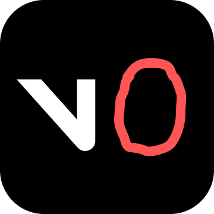

# Temu v0

It doesn't matter which coding platform you use to prototype your front-end. They all use the exact same trick:

1. They use Claude Sonnet 3.5 (or derivatives) because Claude is a very good boy.
2. They install the [shadcn/ui](https://ui.shadcn.com/) library and ask the model not to use anything else.
3. They provide some basic rules that reign in the model's propensity to do more than asked for.

If you look at the system prompts from [Anthropic Artifacts](https://gist.github.com/max/268519b8e0994ffa6a8706850e0b9c3c), [v0](https://github.com/x1xhlol/system-prompts-and-models-of-ai-tools/blob/main/v0%20Prompts%20and%20Tools/Prompt.txt#L23-L24), [Lovable](https://github.com/x1xhlol/system-prompts-and-models-of-ai-tools/blob/main/Lovable/Lovable%20Prompt.txt#L13), Bolt, etc. they all work the exact same way. You want to know what's even crazier? You don't even need Cursor or a fancy IDE. Building the equivalent of Claude Code is [a few hundred lines of code](https://ampcode.com/how-to-build-an-agent).

This template provides a minimal setup to prototype user interfaces. It happens to use Cursor rules so you should probably just use Cursor.

## Vibe-coding locally

1. [Install Bun](https://bun.sh/) (if you have NodeJS installed that works too).
2. Clone this repository or instantiate it as a template.
3. `bun install` in the repository.
4. `bun run dev` and open http://localhost:5173/ in your browser.
5. Ask Cursor to make a change. For example: "Change the label of the button on the homepage to please click me and when the user clicks open an alert that says Hello my dear user."
